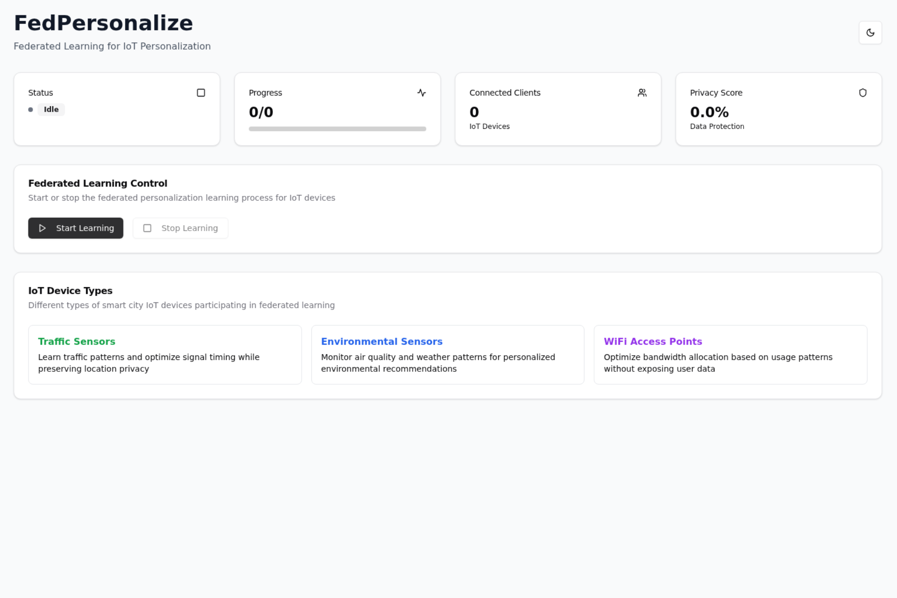

# FedPersonalize - Federated Learning for IoT Personalization



## 🚀 Live Demo

- **Frontend (Live):** https://flower-ai-app-mpri8e6g.devinapps.com/
- **Backend API:** Ready for Render deployment

## 📋 Overview

FedPersonalize is a novel federated learning AI system that enables real-time personalized recommendations for IoT devices in smart cities while preserving privacy. The system combines global knowledge with device-specific adaptation layers, allowing smart city infrastructure to provide personalized services without centralizing sensitive data.

### Key Features

- **Novel Federated Personalization Algorithm**: Combines FedAvg with personalization-aware aggregation
- **IoT Device Simulation**: Traffic sensors, environmental monitors, and WiFi access points
- **Privacy-Preserving Training**: Differential privacy and gradient clipping
- **Real-time Dashboard**: Modern React frontend with dark mode toggle
- **Smart City Context**: Simulates real-world IoT deployment scenarios

## 🏗️ Architecture

### Backend (FastAPI + Flower)
- **FastAPI**: REST API for frontend integration
- **Flower Framework**: Federated learning orchestration
- **Custom Strategy**: `FedPersonalizeStrategy` extending FedAvg
- **IoT Client Simulation**: Multiple device types with realistic data patterns
- **Privacy Features**: Noise injection and gradient clipping

### Frontend (React + TypeScript)
- **React 18**: Modern component-based architecture
- **TypeScript**: Type-safe development
- **Tailwind CSS**: Utility-first styling with dark mode
- **Lucide Icons**: Modern icon library
- **Recharts**: Real-time metrics visualization
- **shadcn/ui**: Pre-built UI components

## 🚀 Render Deployment Guide

### Backend Deployment on Render

**Step 1: Create New Web Service**
1. Go to [Render Dashboard](https://dashboard.render.com/)
2. Click "New +" → "Web Service"
3. Connect your GitHub repository
4. Select the `fedpersonalize-backend` directory

**Step 2: Configure Build & Deploy Settings**

| Setting | Value |
|---------|-------|
| **Name** | `fedpersonalize-backend` |
| **Environment** | `Python 3` |
| **Region** | `Oregon (US West)` or closest to your users |
| **Branch** | `main` |
| **Root Directory** | `fedpersonalize-backend` |
| **Build Command** | `pip install poetry && poetry config virtualenvs.create false && poetry install --only=main` |
| **Start Command** | `poetry run uvicorn app.main:app --host 0.0.0.0 --port $PORT` |

**Step 3: Environment Variables**
```bash
# Required Environment Variables
PYTHON_VERSION=3.12.0
PORT=10000  # Render auto-assigns this
DATABASE_URL=sqlite:///:memory:

# Optional Configuration
FL_ROUNDS=5
FL_CLIENTS=3
LEARNING_RATE=0.01
```

**Step 4: Advanced Settings**
- **Instance Type**: `Starter` (512 MB RAM, 0.1 CPU)
- **Auto-Deploy**: `Yes` (deploys on git push)
- **Health Check Path**: `/healthz`

### Frontend Deployment on Render

**Step 1: Create Static Site**
1. Go to [Render Dashboard](https://dashboard.render.com/)
2. Click "New +" → "Static Site"
3. Connect your GitHub repository
4. Select the `fedpersonalize-frontend` directory

**Step 2: Configure Build Settings**

| Setting | Value |
|---------|-------|
| **Name** | `fedpersonalize-frontend` |
| **Branch** | `main` |
| **Root Directory** | `fedpersonalize-frontend` |
| **Build Command** | `npm install && npm run build` |
| **Publish Directory** | `dist` |

**Step 3: Environment Variables**
```bash
# Frontend Environment Variables
VITE_API_BASE_URL=https://your-backend-name.onrender.com
NODE_VERSION=18.17.0
```

**Step 4: Custom Headers (Optional)**
```yaml
# _headers file for security
/*
  X-Frame-Options: DENY
  X-Content-Type-Options: nosniff
  Referrer-Policy: strict-origin-when-cross-origin
```

### Complete Render Configuration Files

**Backend: `render.yaml` (Optional)**
```yaml
services:
  - type: web
    name: fedpersonalize-backend
    env: python
    region: oregon
    plan: starter
    buildCommand: pip install poetry && poetry config virtualenvs.create false && poetry install --only=main
    startCommand: poetry run uvicorn app.main:app --host 0.0.0.0 --port $PORT
    healthCheckPath: /healthz
    envVars:
      - key: PYTHON_VERSION
        value: 3.12.0
      - key: DATABASE_URL
        value: sqlite:///:memory:
```

**Frontend: Package.json Build Script**
```json
{
  "scripts": {
    "build": "tsc -b && vite build",
    "preview": "vite preview"
  },
  "engines": {
    "node": ">=18.0.0"
  }
}
```

## 🛠️ Local Development Setup

### Prerequisites

- **Node.js** 18+ (for frontend)
- **Python** 3.12+ (for backend)
- **Poetry** (Python dependency management)
- **pnpm/npm** (Node.js package management)

### Backend Setup

1. **Navigate to backend directory:**
   ```bash
   cd fedpersonalize-backend
   ```

2. **Install dependencies:**
   ```bash
   poetry install
   ```

3. **Start development server:**
   ```bash
   poetry run uvicorn app.main:app --reload
   ```

4. **Test API endpoints:**
   ```bash
   curl http://localhost:8000/healthz
   curl http://localhost:8000/fl/status
   ```

**Available Endpoints:**
- `GET /healthz` - Health check
- `GET /fl/status` - Federated learning status
- `POST /fl/start` - Start federated learning
- `POST /fl/stop` - Stop federated learning
- `GET /fl/metrics` - Get training metrics

### Frontend Setup

1. **Navigate to frontend directory:**
   ```bash
   cd fedpersonalize-frontend
   ```

2. **Install dependencies:**
   ```bash
   npm install
   ```

3. **Start development server:**
   ```bash
   npm run dev
   ```

4. **Access application:**
   Open http://localhost:5173 in your browser

### Full System Testing

1. **Start backend** (Terminal 1):
   ```bash
   cd fedpersonalize-backend
   poetry run uvicorn app.main:app --reload
   ```

2. **Start frontend** (Terminal 2):
   ```bash
   cd fedpersonalize-frontend
   npm run dev
   ```

3. **Test federated learning:**
   - Open http://localhost:5173
   - Click "Start Learning" button
   - Watch real-time metrics update
   - Test dark mode toggle

## 🔬 Technical Implementation

### Federated Learning Components

**PersonalizationModel** (`federated/task.py`):
```python
class PersonalizationModel(nn.Module):
    def __init__(self, input_dim=64, hidden_dim=128, output_dim=10):
        super().__init__()
        self.global_encoder = nn.Sequential(...)
        self.personal_adapter = nn.Sequential(...)
        self.classifier = nn.Linear(...)
```

**Custom Strategy** (`federated/server_app.py`):
```python
class FedPersonalizeStrategy(FedAvg):
    def aggregate_fit(self, server_round, results, failures):
        # Personalization-aware aggregation
        # Privacy metrics calculation
        # Device diversity tracking
```

**IoT Client Simulation** (`federated/client_app.py`):
```python
class IoTPersonalizationClient(NumPyClient):
    def __init__(self, device_type, device_id):
        # Traffic sensors, environmental sensors, WiFi APs
        # Synthetic data generation with realistic patterns
```

### Privacy Features

- **Differential Privacy**: Noise injection during training
- **Gradient Clipping**: Prevents gradient explosion attacks
- **Federated Architecture**: No raw data leaves devices
- **Personalization Layers**: Local adaptation without data sharing

### Frontend State Management

```typescript
interface FLStatus {
  status: 'idle' | 'running' | 'completed'
  current_round: number
  total_rounds: number
  clients_connected: number
  metrics: Metric[]
}
```

## 📊 Metrics & Monitoring

The system tracks several key metrics:

- **Model Accuracy**: Federated model performance
- **Privacy Score**: Privacy preservation effectiveness
- **Personalization Gain**: Improvement over baseline
- **Device Diversity**: Number of participating device types
- **Round Progress**: Training round completion

## 🎨 UI/UX Features

- **Dark Mode Toggle**: Seamless light/dark theme switching
- **Real-time Charts**: Live federated learning metrics
- **Responsive Design**: Mobile and desktop optimized
- **Status Indicators**: Clear visual feedback
- **Modern Icons**: Lucide icon library integration

## 🔧 Configuration

### Environment Variables

**Backend** (`.env`):
```env
# Database (in-memory for demo)
DATABASE_URL=sqlite:///:memory:

# Federated Learning
FL_ROUNDS=5
FL_CLIENTS=3
LEARNING_RATE=0.01
```

**Frontend** (`.env`):
```env
VITE_API_BASE_URL=http://localhost:8000
```

### Production Configuration

**Backend** (deployed):
- API Base: `https://app-okhqlodl.fly.dev`
- CORS enabled for frontend domain
- Health checks on `/healthz`

**Frontend** (deployed):
- API Base: `https://app-okhqlodl.fly.dev`
- Static assets served via CDN
- HTTPS enforced

## 🚨 Known Issues

1. **Backend Deployment**: Currently experiencing Fly.io machine limits
   - Error: "Your organization has reached its machine limit"
   - Solution: Contact billing@fly.io to increase limits

2. **Dependency Conflicts**: 
   - `flwr` requires `typer <0.13.0`
   - `fastapi[standard]` requires `typer >=0.15.1`
   - Workaround: Using `uvicorn` directly instead of `fastapi run`

## 🔮 Future Enhancements

- **Real IoT Integration**: Connect to actual IoT devices
- **Advanced Privacy**: Homomorphic encryption support
- **Scalability**: Kubernetes deployment for large-scale testing
- **Analytics**: Advanced federated learning analytics dashboard
- **Multi-tenant**: Support for multiple smart city deployments

## 📄 License

This project is a proof-of-concept for federated learning in smart cities. Built with Flower framework and modern web technologies.

## 🤝 Contributing

1. Fork the repository
2. Create feature branch (`git checkout -b feature/amazing-feature`)
3. Commit changes (`git commit -m 'Add amazing feature'`)
4. Push to branch (`git push origin feature/amazing-feature`)
5. Open Pull Request

---

**Built with ❤️ using Flower, FastAPI, React, and modern deployment platforms**
